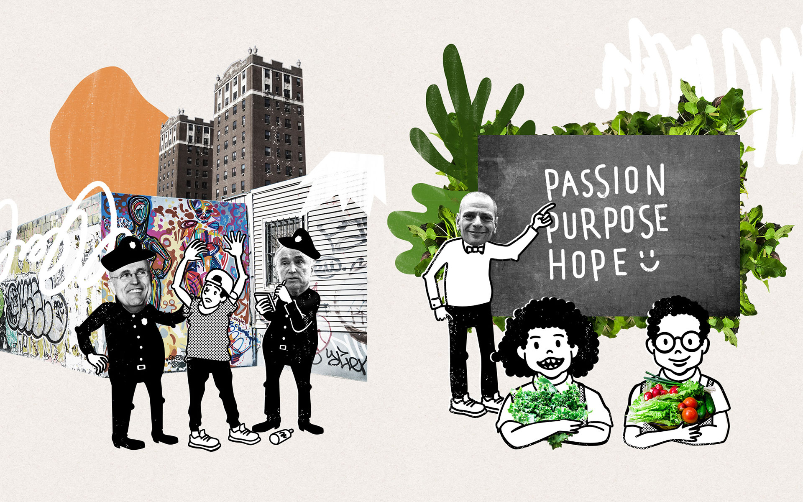
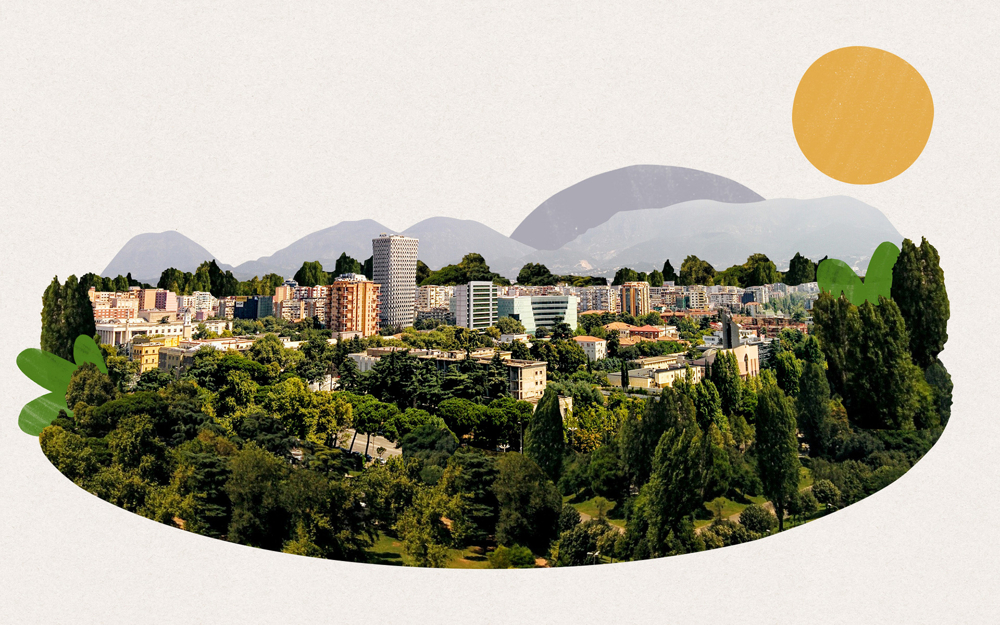
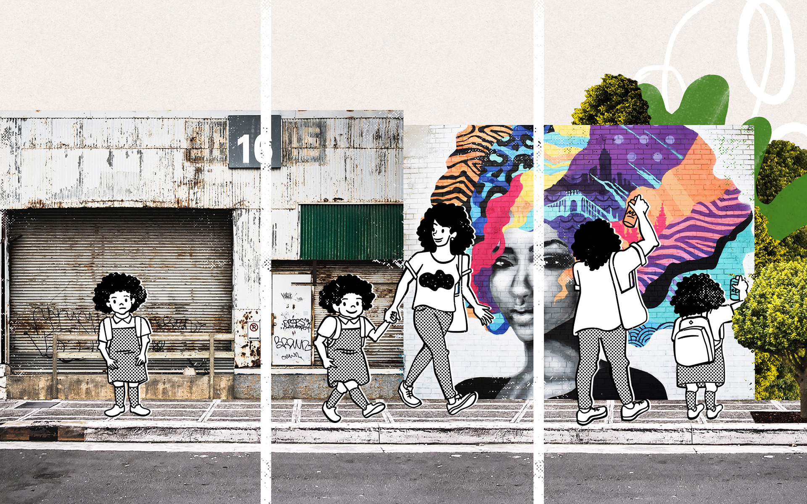

El arte callejero como intervención urbana que rompe fronteras. Ilustraciones para el artículo “Del arquitecto, al graffitero, y del policía al maestro.” de Casa de las Estrategias para La Silla Llena.

[Del arquitecto al graffitero y del policía al maestro・La Silla Llena](https://www.lasillavacia.com/historias/historias-silla-llena/del-arquitecto-al-graffitero-y-del-policia-al-maestro){:target='_blank'}

Fotos: Chris Barbalis y Marc Olivier. Unsplash.com
