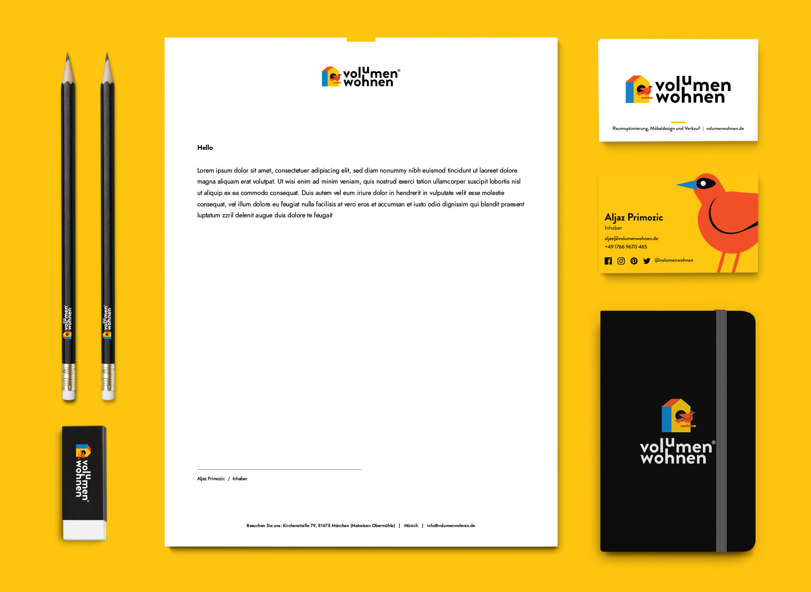
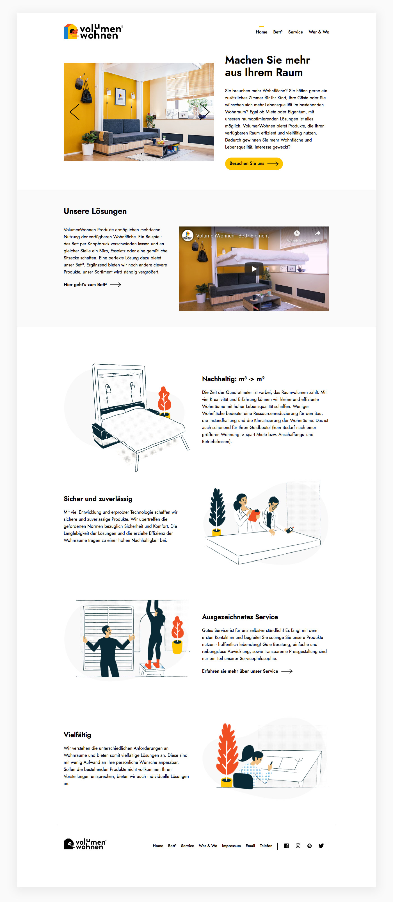
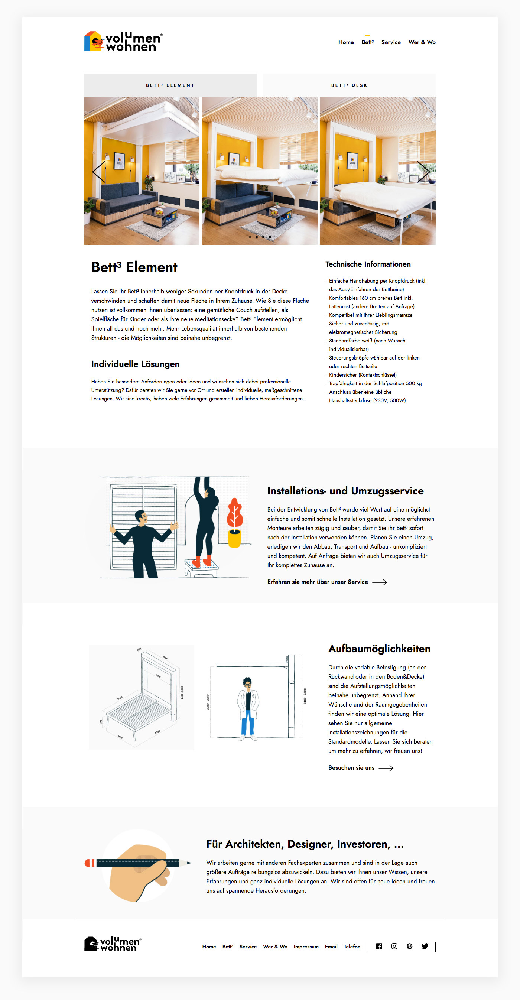
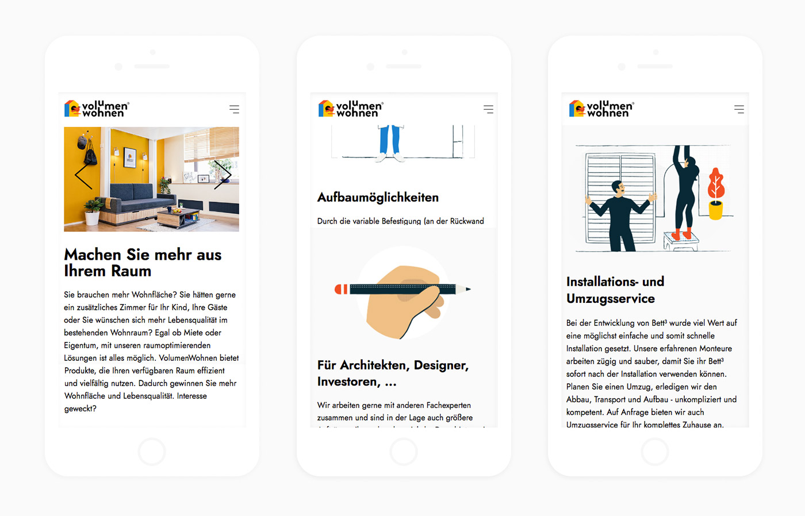
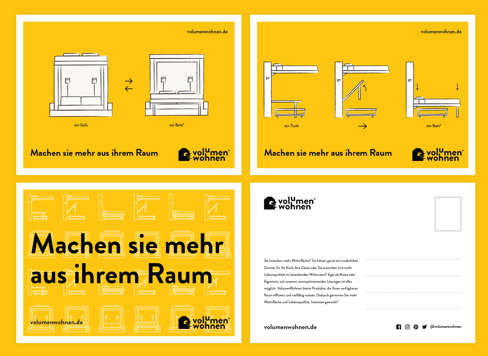

Volumen Wohnen es una marca de diseño de muebles enfocada en el uso inteligente de espacios reducidos. Optimizan los espacios para que se puedan usar de varias maneras.

[volumenvohnen.de](https://www.volumenwohnen.de/){:target='_blank'}

