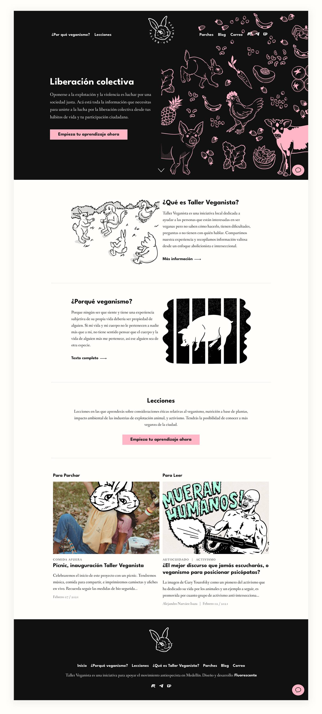
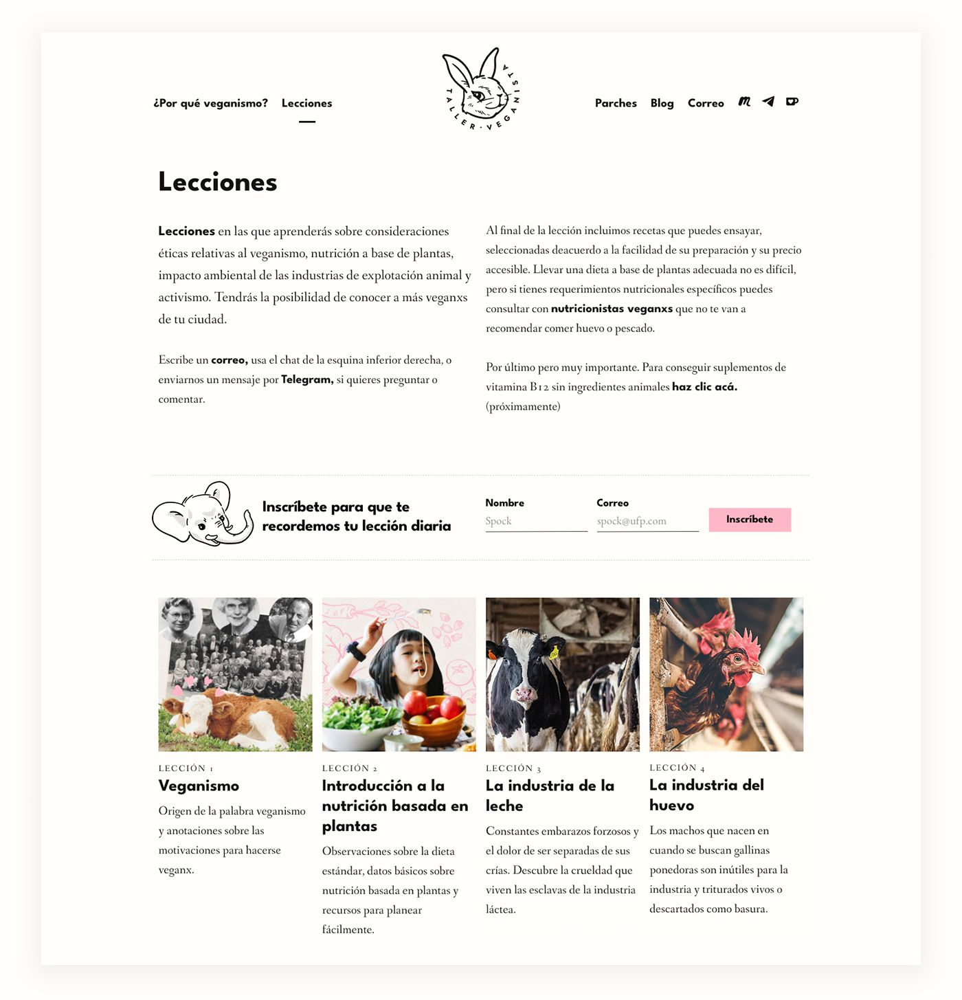
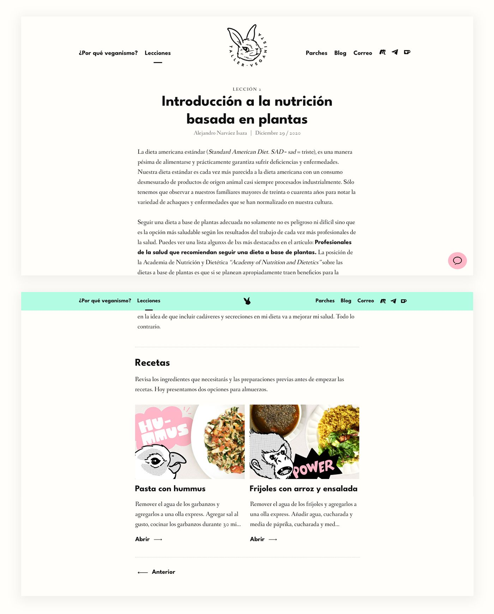
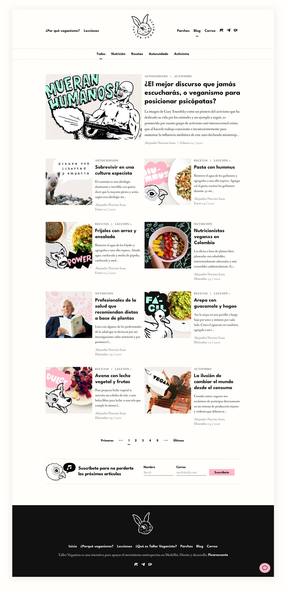
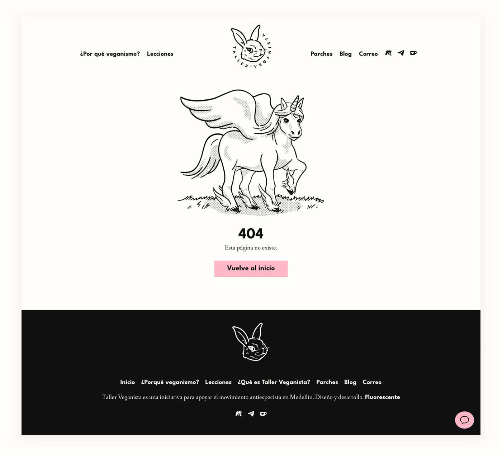
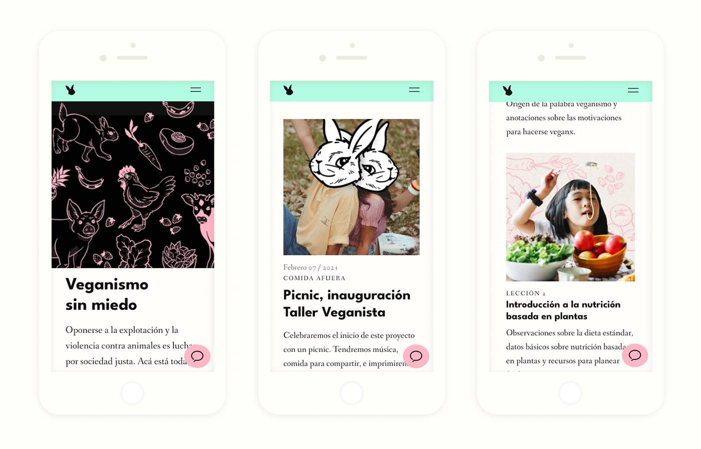
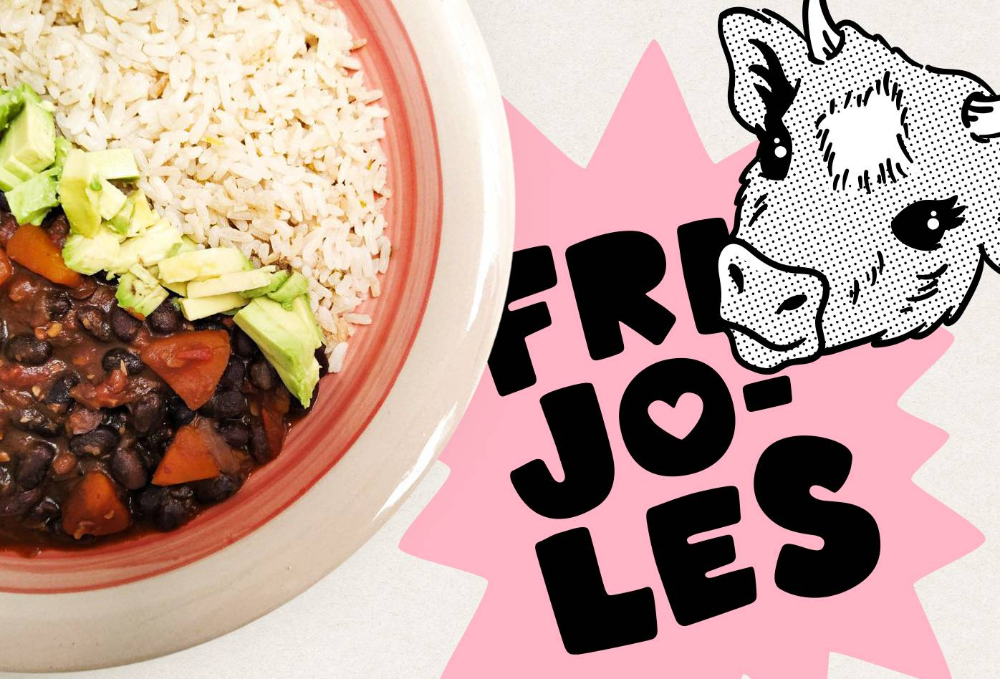
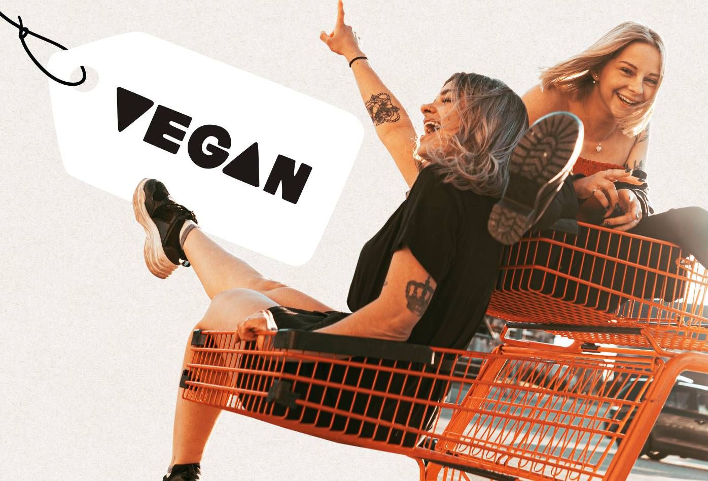

Taller Veganista es una iniciativa local dedicada a ayudar a las personas que están interesadas en ser veganas pero no saben cómo hacerlo, tienen dificultades, preguntas, o no tienen con quién hablar.

Generalmente el diseño de proyectos para la promoción del veganismo incorpora lenguajes gráficos enfocados a conectar con quienes buscan llegar a objetivos de transformación física, salud y crecimiento espiritual. En este proyecto estoy intentando usar lenguajes compatibles con personas con posiciones críticas frente establecimiento que valoran la ilustración, el lettering y el arte callejero.

El sitio está generado por Jekyll y se puede administrar desde el CMS Forestry.

[talerveganista.com](https://tallerveganista.com/){:target='_blank'}

